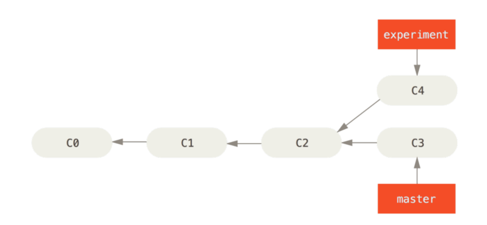
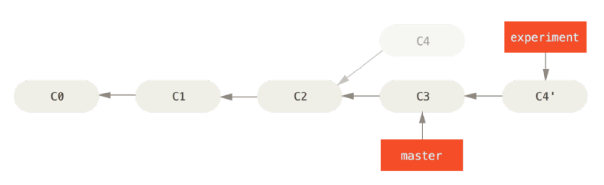

# GIT Pro笔记

## 1.GIT基础


## 2.GIT分支

### 2.1 分支创建/切换/删除

```shell
git branch hotfix
git branch -v
git checkout hotfix

# 或者
git checkout -b hotfix

# 分支合并后可以删除
git branch -d hotfix
# 强制删除
git branch -D hotfix
```

### 2.2 合并分支到master

```shell
git checkout master
git merge hotfix

# 删除
git branch -d hotfix
```

### 2.3 推送本地分支到远程

```shell
git push origin feature/test:feature/test

git push origin [local_branch]:[remote_branch]

# remote branch 可以省略
git push origin feature/test
```

### 2.4 分支其他

```shell
# 查看分支
git branch
# 查看分支最后一次提交
git branch -v
# 查看分支的合并情况
git branch --merged
git branch --no-merged

# 查看所有的分支跟踪情况
git branch -vv

# 查看远程分支
git branch -a

```

### 2.5远程分支

```shell
#查看远程分支详细情况
git remote show origin

# 同步远程分支到本地
git fetch origin
# 合并远程分支到当前分支，尽量不要使用git pull 命令
git merge origin/serverfix

# 推送
git push -u origin master
# 如果需要把本地的分支推送到远程，跟大家共享，请参考2.3

# 跟踪分支(另起一个新分支)
git checkout -b [branch] [remotename]/[branch]
git checkout -b hotfix001 origin/hotfix
# 也可以使用下面的命令,会在本地自动创建serverfix分支
git checkout --track origin/serverfix

# 设置已有的本地分支跟踪一个刚刚拉取下来的远程分支，或者想要修改正在跟踪的上游分支
git branch -u origin/serverfix

# 删除远程分支
git push origin --delete serverfix 

# 设置本地某分支跟踪远程某分支
# 设置本地的serverfix分支跟踪远程的origin/<branch>
git branch --set-upstream-to=origin/<branch> serverfix
# 或者
git branch -u origin/<branch> serverfix


```

### 2.6 变基

在 Git 中整合来自不同分支的修改主要有两种方法：merge 以及 rebase 



````shell
# 变基
git checkout experiment
git rebase master
````

它的原理是首先找到这两个分支（即当前分支 experiment、变基操作的目标基底分支 master）的最近共同祖
先 C2，然后对比当前分支相对于该祖先的历次提交，提取相应的修改并存为临时文件，然后将当前分支指向目
标基底 C3, 最后以此将之前另存为临时文件的修改依序应用。 




```shell
# 然后把变基后的修改，merge到master分支
git checkout master
git merge experiment

```


## 3.日志输出相关

```shell
# 提交历史、各个分支的指向以及项目的分支分叉情况
git log --oneline --decorate --graph --all
```


